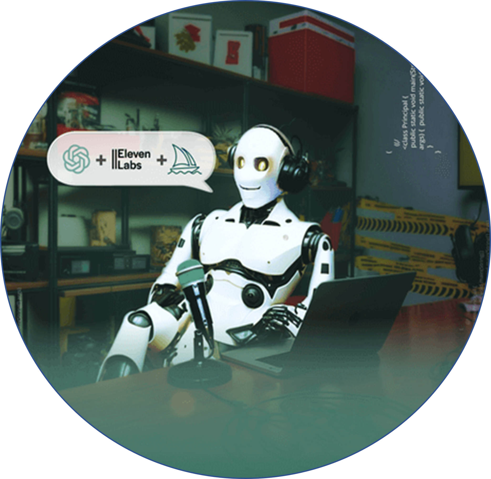

    Áudio do Podcast - Preview

    <audio src="assets/Som Podcast - ElevenLabs.MP3" controls title="Som do Podcast ElevenLabs"></audio>

# Projeto Podcast Gerado por I.A.s

 > ℹ️ **NOTE:** Este é o repositório desenvolvido a partir de uma live no Youtube da [DIO](https://dio.me)

O desafio do Bootcamp "Microsoft 50 Anos - Prompts Inteligentes" tem o objetivo de gerar um podcast utilizando ferramentas de IA através de prompts mais trabalhado.

Utilizer uma esteira de prompts para gerar cada etapa do processo criativo.

## 💻 Tecnologias utilizadas no projeto:

- [ChatGPT](https://chat.openai.com/) 
- [Sora](https://openai.com/index/sora/)
- [ElevenLabs](https://beta.elevenlabs.io/)
- [Capcut](https://www.capcut.com/pt-br/)

## ✨ Como foi feito ?

- Roteiro gerado via chatgpt
- Audio gerado pela elevenLabs
- Sora Para gerar capas
- Capcut para tratar aúdio e adicionar sons de fundo

## 📚 Materiais

- [Link da live no Youtube](https://www.youtube.com)
- [Notion Template](https://helpful-jump-17b.notion.site/PAS-Podcast-AI-Studio-210489e15d7a4a73b743bb159e45d06f?pvs=4)
- [Editor de aúdio](https://www.capcut.com/editor?from_page=landing_page&__action_from=picture_V%C3%ADdeos%20profissionais%20em%20minutos,%20n%C3%A3o%20em%20horas.)
- [Github do Instrutor do Curso](https://github.com/felipeAguiarCode/prompts-for-podcast-generate-by-ia)

## 🛠️ Instruções de execução

Foram utilizados como exemplo os prompts dentro do link do `Notion` fornecido no curso para criar um podcast de maneira automatizada, para isso siga o passo a passo abaixo:

- 🤖 1. Usei como exemplos os prompts de roteiro no `ChatGPT`
- 🤖 2. Usei como exemplos prompts de artes no `Midjourney` gerados pelo `ChatGPT`, apesar de ter utilizado o `Sora` para geração de imagens
- 🤖 3. Usei como exemplos prompts de roteiro gerados pelo `ChatGPT` no  `ElevenLabs` para gerar o áudio
- 🤖 4. Usei como exemplos prompts de edição gerados pelo `ChatGPT` no  `CapCut`

## 👨‍💻 Podcast - "Prompt Wars – A Vingança dos Tokens"

    preview do podcast

    <audio src="output/podcast_editado.MP3" controls title="Podcast editado"></audio>

